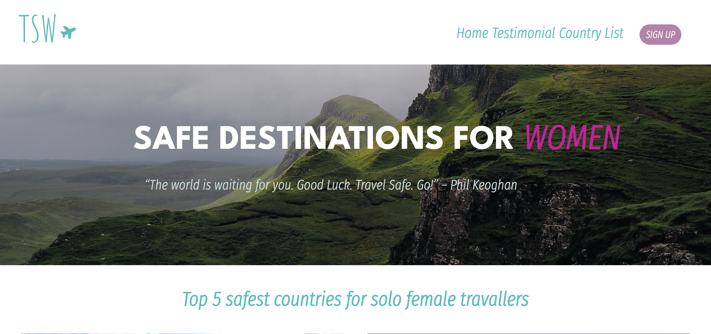

# [TSW - Travel Safety for Woman](https://tsw.netlify.app/)

Project made for the second project of IronHack's Web Development Bootcamp São Paulo - Remote.

We use **ReactJS, HTML, CSS, JavaScript** and the libraries **Axios, ant design, material UI, and grommet**.

Women travel for countless reasons, whether to discover new frontiers, pursue business opportunities, or simply to rest and relax – but not unlike men. There’s a huge difference between women and men, when it comes to health and security, and how travelers are affected by the religious and cultural beliefs of the foreign countries they visit. The truth is that women face greater obstacles, especially when traveling alone. Considering that, our project is a website with information about the security of countries, aimed to help women to travel safely. It contains the "GeoSure" ranking, which explains if a country is secure and if it is not, the reasons for it. Also, In TSW you can check the comments of women describing their experiences and impressions while traveling to a certain country, as well as other important information.

Made by [Caroline](https://github.com/carolineabreu), [Larissa](https://github.com/larissambn) and [Zimarlen](https://github.com/ZihSilva).
